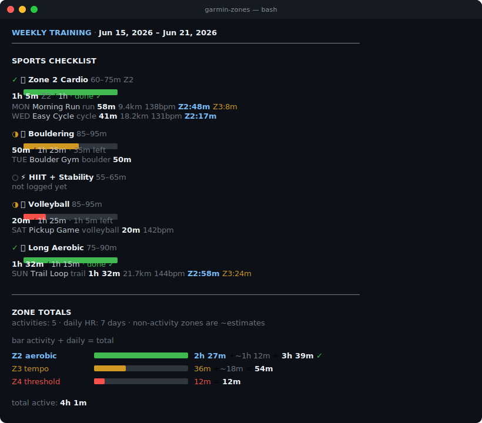

# garmin-weekly-zones

> A terminal-friendly weekly training tracker that pulls activities and heart-rate data from Garmin Connect, matches them to your configured sports plan, and shows progress toward weekly targets — including non-activity zone time.

[](https://github.com/dark-eraser/garmin-weekly-zones/actions/workflows/ci.yml)
[](https://opensource.org/licenses/MIT)
[](https://bun.sh)
[](https://www.typescriptlang.org/)

---

## What it looks like

<p align="center">
  
</p>

<details>
<summary>Plain-text version</summary>

```
  WEEKLY TRAINING  ·  Jun 15, 2026 – Jun 21, 2026
  ──────────────────────────────────────────────────────────────

  SPORTS CHECKLIST

  ✓  🏃  Zone 2 Cardio  60–75m Z2
     ████████████████████  1h 5m Z2 / 1h · done ✓
     MON  Morning Run  run  58m  9.4km  138bpm  Z2:48m  Z3:8m
     WED  Easy Cycle  cycle  41m  18.2km  131bpm  Z2:17m

  ◑  🧗  Bouldering  85–95m
     ███████████░░░░░░░░░  50m / 1h 25m · 35m left
     TUE  Boulder Gym  boulder  50m

  ○  ⚡  HIIT + Stability  55–65m
     not logged yet

  ◑  🏐  Volleyball  85–95m
     ████░░░░░░░░░░░░░░░░  20m / 1h 25m · 1h 5m left
     SAT  Pickup Game  volleyball  20m  142bpm

  ○  🔥  High-Intensity  90–120m
     not logged yet

  ✓  🚴  Long Aerobic  75–90m
     ████████████████████  1h 32m / 1h 15m · done ✓
     SUN  Trail Loop  trail  1h 32m  21.7km  144bpm  Z2:58m  Z3:24m

  ○  🧘  Mobility Only  30–45m
     not logged yet

  ──────────────────────────────────────────────────────────────

  ZONE TOTALS
  activities: 5 · daily HR: 7 days · non-activity zones are ~estimates

                  bar                   activity  + daily   = total
  Z2  aerobic    ████████████████████   2h 27m  +~1h 12m  = 3h 39m ✓
  Z3  tempo      ██████░░░░░░░░░░░░     36m     +~ 18m    = 54m
  Z4  threshold  ██░░░░░░░░░░░░░░░░     12m                = 12m

  total active:  4h 1m
```

</details>

The real terminal output is fully colored — green/yellow/red progress bars, cyan headers, gray meta, and zone-coded HR splits.

---

## Prerequisites

| Dependency | Why | Install |
|---|---|---|
| [Bun](https://bun.sh) `>=1.0` | runtime for the TypeScript script | `curl -fsSL https://bun.sh/install \| bash` |
| [`garmin-connect` CLI](https://www.npmjs.com/package/garmin-connect) | reads activities + daily HR | `bun add -g garmin-connect` |
| Garmin Connect account | the data source | login with `garmin-connect auth login` |

---

## Installation

### One-liner

```bash
curl -fsSL https://raw.githubusercontent.com/dark-eraser/garmin-weekly-zones/main/install.sh | bash
```

The installer:

1. Verifies `bun` is on your PATH (and points you to `bun.sh` if not).
2. Installs `garmin-connect` globally via `bun add -g garmin-connect` if it isn't already.
3. Clones the repo to `~/.garmin-weekly-zones/`.
4. Symlinks `bin/garmin-zones` to `/usr/local/bin/garmin-zones` (uses `sudo` only if needed).
5. Prints next steps.

It is idempotent — re-running it will fast-forward the repo and refresh the symlink, not blow anything away.

### Manual

```bash
git clone https://github.com/dark-eraser/garmin-weekly-zones.git ~/.garmin-weekly-zones
chmod +x ~/.garmin-weekly-zones/bin/garmin-zones
ln -s ~/.garmin-weekly-zones/bin/garmin-zones /usr/local/bin/garmin-zones

bun add -g garmin-connect
garmin-connect auth login
garmin-zones setup
```

---

## Usage

```
garmin-zones                        # current week (Mon–Sun)
garmin-zones --week 2026-06-08      # the week containing this date
garmin-zones --no-daily             # skip daily HR fetch (much faster)
garmin-zones --help                 # show usage
garmin-zones --version              # print version
garmin-zones setup                  # run the interactive setup wizard
garmin-zones setup --reset          # clear the config and reconfigure
```

### First-run

The very first time you run `garmin-zones`, it detects there's no config and walks you through the setup wizard automatically. After that, it just shows your week.

---

## Configuration

Your weekly plan lives at:

```
~/.garmin-zones/config.json
```

It's a simple JSON file you can edit by hand, or regenerate via `garmin-zones setup --reset`.

### Example

```json
{
  "version": 1,
  "sports": [
    { "key": "zone2",         "emoji": "🏃", "name": "Zone 2 Cardio",   "description": "easy run or ride",        "targetMin": 60, "targetMax": 75,  "metric": "zone2" },
    { "key": "bouldering",    "emoji": "🧗", "name": "Bouldering",      "description": "~90 min moderate",        "targetMin": 85, "targetMax": 95,  "metric": "duration" },
    { "key": "hiit",          "emoji": "⚡", "name": "HIIT + Stability", "description": "intervals + core",        "targetMin": 55, "targetMax": 65,  "metric": "duration" },
    { "key": "volleyball",    "emoji": "🏐", "name": "Volleyball",      "description": "~90 min",                  "targetMin": 85, "targetMax": 95,  "metric": "duration" },
    { "key": "highIntensity", "emoji": "🔥", "name": "High-Intensity",  "description": "90–120 min flexible",     "targetMin": 90, "targetMax": 120, "metric": "duration" },
    { "key": "longAerobic",   "emoji": "🚴", "name": "Long Aerobic",    "description": "75–90 min ride or trail", "targetMin": 75, "targetMax": 90,  "metric": "duration" },
    { "key": "mobility",      "emoji": "🧘", "name": "Mobility Only",   "description": "30–45 min stretching",    "targetMin": 30, "targetMax": 45,  "metric": "duration" }
  ],
  "zones": { "z2": 125, "z3": 146, "z4": 162, "z5": 176 }
}
```

### Fields

| Field | Meaning |
|---|---|
| `key` | Stable identifier used by the matcher (`zone2`, `bouldering`, `hiit`, `volleyball`, `highIntensity`, `longAerobic`, `mobility`, `tennis`, or a custom slug). |
| `emoji` | Shown in the checklist. |
| `name` | Display name in the checklist header. |
| `description` | Short helper text. |
| `targetMin` / `targetMax` | Weekly target band in minutes. Bar reaches full when you hit `targetMin`. |
| `metric` | `zone2` counts only Zone-2 minutes in matching activities. `duration` counts total activity time. |
| `zones` | BPM lower-bounds for Z2–Z5. A sample falls in Z1 if `bpm < z2`, Z2 if `z2 ≤ bpm < z3`, etc. Z5 has no upper bound. |

> The **weekly Z2 target** in the *Zone Totals* section is read straight from the `zone2` sport entry's `targetMin`. Change one place, both views update.

### Configuring zone thresholds

The setup wizard offers three ways to set your BPM zone boundaries:

1. **Auto-calculate from max HR** *(recommended)* — enter your max heart rate and the wizard applies standard %-of-max bands:
   - Z2 ≈ 64% of max
   - Z3 ≈ 75% of max
   - Z4 ≈ 83% of max
   - Z5 ≈ 90% of max
2. **Manual** — type the four boundary BPM values yourself.
3. **Defaults** — `{ z2: 125, z3: 146, z4: 162, z5: 176 }` (sensible for a max HR around 195).

You can also edit the `zones` block in `~/.garmin-zones/config.json` directly. Values must be strictly increasing; invalid input falls back to defaults.

These thresholds are applied **only to non-activity HR samples** — activity zones still come straight from Garmin's `hrTimeInZone_*` fields, which use the zones configured on your watch. The "~estimates" disclaimer in the output stays because raw-sample bucketing is still an approximation no matter how well-tuned the boundaries are.

---

## How it works

1. **Window selection.** Computes the Monday–Sunday window for the chosen week. `--week YYYY-MM-DD` snaps to the Monday of whatever week the date falls in.
2. **Activities fetch.** Calls `garmin-connect activities list --after <Monday>` and filters down to activities that started inside the window.
3. **Daily HR fetch (optional).** For each day of the week that's already happened, calls `garmin-connect health heart-rate --date <YYYY-MM-DD>` and aggregates the 2-second-cadence HR samples. Samples that fall inside any activity window (start → end + 3 minutes) are excluded so we don't double-count.
4. **Sport matching.** Each activity is bucketed into one of your configured sports using a small set of heuristics: activity type, name keywords, training-effect labels, and HR-zone distribution. Activities that don't match a configured sport are listed under *unmatched*.
5. **Rendering.** Sports checklist (with per-activity breakdown and a coloured progress bar) followed by a zone-totals roll-up that combines activity zones with the non-activity HR estimate.

### Sport matching highlights

- `climbing` / `bouldering` / `indoor_climbing` / `rock_climbing` → **bouldering**
- `yoga` / `flexibility` / `stretching` (or names containing "stretch"/"mobil") → **mobility**
- `tennis` → **tennis** if configured, otherwise **highIntensity**
- `swimming` / `open_water_swimming` / `pool_swimming` → **longAerobic** if ≥60 min, else **zone2**
- `hiit` / `strength_training` / `cardio` → **hiit**
- Aerobic family (`running`, `cycling`, `hiking`, `trail_running`, `walking`, `indoor_cycling`):
  - ≥70 min → **longAerobic**
  - Garmin training-effect "aerobic base" / "recovery" → **zone2**
  - Garmin training-effect "anaerobic" / "vo2" or high Z3+Z4 → **highIntensity**
  - At least 10 min in Z2 → **zone2**

---

## Zone thresholds

Heart-rate zones for non-activity samples are computed against the BPM bands in your `~/.garmin-zones/config.json` `zones` block. The defaults — reasonable for an athlete with a max HR around 195 — are:

| Zone | Range (bpm) | What it represents |
|---|---|---|
| **Z1** | `< 125`      | Rest / very easy |
| **Z2** | `125–145`    | Aerobic base |
| **Z3** | `146–161`    | Tempo |
| **Z4** | `162–175`    | Threshold |
| **Z5** | `≥ 176`      | VO2 max / anaerobic |

Re-run `garmin-zones setup --reset` to recalculate them from your max HR, or edit the `zones` block in the config file directly. Activity zones come straight from Garmin's `hrTimeInZone_*` fields, which use the zones configured on your watch — they're unaffected by these thresholds.

---

## Troubleshooting

| Symptom | Fix |
|---|---|
| `garmin-connect CLI not found` | `bun add -g garmin-connect` |
| Auth failure on launch | `garmin-connect auth login` |
| No activities show up | Confirm the activity is synced to Garmin Connect (not stuck on the watch) |
| Setup wizard exits immediately | You're not running in an interactive terminal; run it directly, not via pipe |
| Want a different week | `garmin-zones --week 2026-06-08` |

### Exit codes

`garmin-zones` returns standard exit codes for scripting:

| Code | Meaning |
|---|---|
| `0` | Success |
| `1` | User error (bad flag, invalid `--week` date, unknown argument) |
| `2` | Garmin Connect authentication failure |
| `127` | Missing external dependency (`bun` or `garmin-connect` not on PATH) |

---

## Contributing

Issues and pull requests welcome.

```bash
git clone https://github.com/dark-eraser/garmin-weekly-zones.git
cd garmin-weekly-zones
bun install
bun test
bun src/index.ts --help
```

A few simple guidelines:
- Keep the output format (sports checklist + zone totals) stable — it's the whole point.
- Bun-only — no Node-isms, no npm.
- Prefer adding new sports/matchers in `matchSport()` rather than splitting modules until the file actually gets big.

---

## License

[MIT](./LICENSE) © dark-eraser
